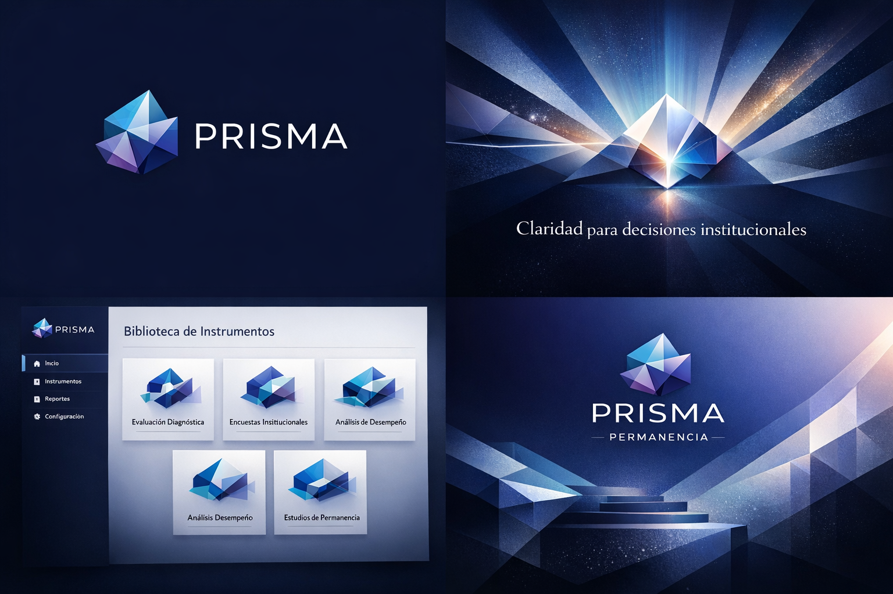
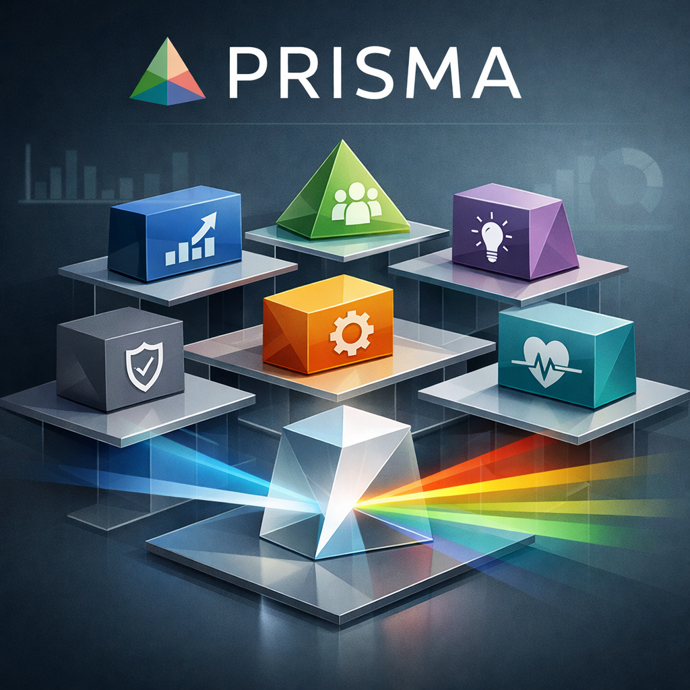
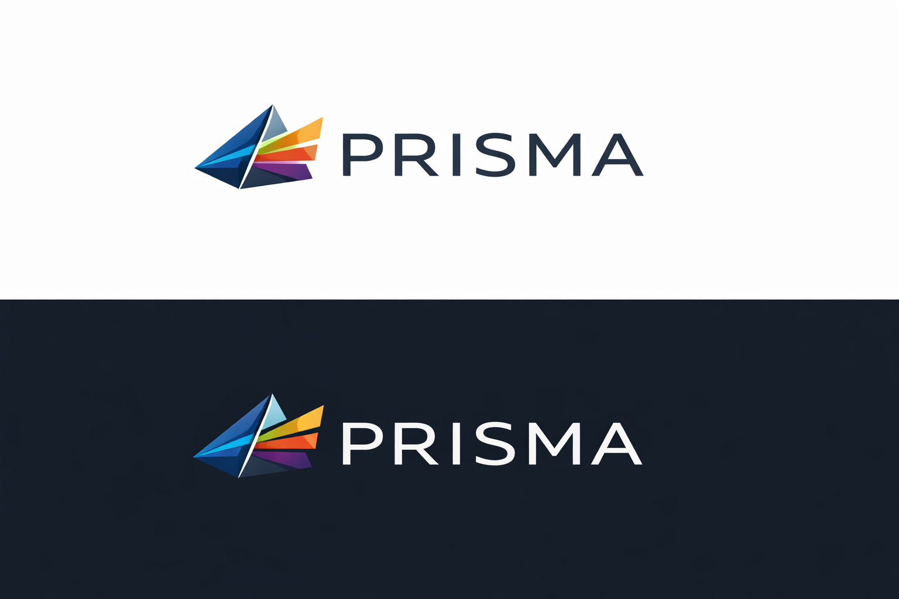

# Exploraciones Visuales

Este directorio reúne las primeras imágenes exploratorias para PRISMA.

No representan una identidad final aprobada.

Funcionan como insumo para discutir dirección visual, tono institucional y posibles usos en repositorio, propuestas, presentaciones y documentación.

## Criterio Visual General

PRISMA debe sentirse:

- institucional;
- serio;
- inteligente;
- metodológico;
- claro;
- accionable;
- cercano a educación superior;
- más producto diagnóstico que consultoría;
- más instrumento de decisión que encuesta.

Debe evitar:

- estética genérica de inteligencia artificial;
- robots, cerebros o circuitos obvios;
- imágenes infantiles de educación;
- exceso de arcoíris literal;
- look bancario o corporativo frío;
- promesa visual de predicción absoluta.

## Assets Incorporados

## 1. Sistema Visual PRISMA

Uso sugerido:

- README;
- presentación interna;
- primera conversación de marca;
- inspiración para identidad.

Lectura:

Es la pieza más completa para comunicar el universo PRISMA: logo, biblioteca de instrumentos, claridad institucional y PRISMA Permanencia.

Riesgo:

Tiene demasiado lenguaje visual oscuro y algunos textos generados. Debe usarse como exploración, no como arte final.

## 2. Contexto Institucional Universitario

Uso sugerido:

- propuestas comerciales;
- materiales de conversación con IES;
- secciones sobre cliente, stakeholders o validación.

Lectura:

Aporta humanidad, conversación institucional y entorno universitario.

Riesgo:

Puede sentirse genérica si se usa como pieza principal de marca. Mejor como apoyo contextual.

## 3. Hero Claro Analítica

Uso sugerido:

- encabezados de documentos;
- portada de presentación;
- secciones de plataforma o reportes.

Lectura:

Transmite análisis, claridad y toma de decisiones. Es más sobria y luminosa que las piezas oscuras.

Riesgo:

Puede acercarse a estética corporativa genérica si no se acompaña de lenguaje PRISMA.

## 4. Del Dato A La Decisión

Uso sugerido:

- explicar la tesis central;
- ilustrar transformación de información dispersa en rutas de acción;
- materiales sobre metodología.

Lectura:

Tiene una metáfora fuerte: datos entran, decisión sale.

Riesgo:

Los íconos pueden sentirse demasiado literales. Conviene refinarla hacia una versión menos genérica.

## 5. Biblioteca De Instrumentos

Uso sugerido:

- explicar el portafolio;
- hablar de biblioteca PRISMA;
- mostrar que el negocio no es un único diagnóstico.

Lectura:

Comunica biblioteca, módulos y variedad de instrumentos.

Riesgo:

Los íconos pueden llevar la marca hacia un lenguaje más corporativo y menos institucional-educativo.

## 6. Prisma Abstracto

Uso sugerido:

- exploración de isotipo;
- fondos abstractos;
- inspiración para sistema visual.

Lectura:

Es una metáfora visual limpia de transformación, facetas y multidimensionalidad.

Riesgo:

Si se usa solo, puede sentirse demasiado abstracto y perder conexión institucional.

## 7. Logo Horizontal

Uso sugerido:

- exploración de logo;
- base para discutir isotipo y wordmark;
- referencia para versión claro/oscuro.

Lectura:

Es la dirección más limpia para identidad: simple, legible y adaptable.

Riesgo:

El símbolo aún puede parecer genérico. Requiere refinamiento vectorial y definición tipográfica real.

## Recomendación Inicial

Usar como dirección provisional:

- logo base: exploración 7;
- hero de repo: exploración 1;
- contexto institucional: exploración 2;
- explicación de metodología: exploración 4;
- biblioteca de instrumentos: exploración 5.

## Próximo Paso Visual

Crear una versión refinada de identidad visual con:

- logo vectorial;
- isotipo;
- versión horizontal;
- versión monocromática;
- paleta;
- tipografía;
- uso sobre fondo claro y oscuro;
- hero limpio sin textos generados;
- portada para propuesta comercial.

